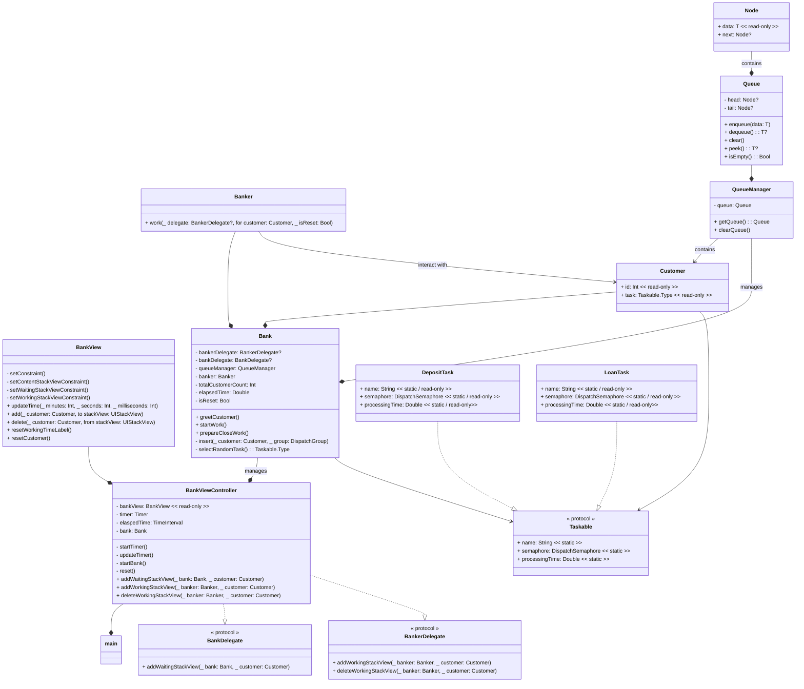

### 프로젝트 참여자 🤝

|  |  |
| ----------- | --------- |
| [@SimJaeHyeok](https://github.com/SimJaeHyeok) | [@shlim0](https://github.com/shlim0) |
| JaeHyeok | Jjong |

 

### UML

---

### 구동 화면📱

---
|앱 실행 시 | 업무 완료 후 고객 추가 시| 업무 종료 후 초기화 버튼 클릭 시 |
|------|---|---|
||||
|&nbsp;&nbsp;&nbsp;업무 도중 고객 추가 버튼 클릭 시&nbsp;&nbsp;|&nbsp;&nbsp;&nbsp;&nbsp;대기 중 화면 스크롤 시&nbsp;&nbsp;&nbsp;|&nbsp;&nbsp;&nbsp;업무 도중 초기화 버튼 클릭 시&nbsp;&nbsp;&nbsp;|
||||

### 트러블 슈팅(추구하고자 했던 방향과 오류 그리고 알게된 점) ⛳️

---
[JaeHyeok & Jjong Trouble Shooting](https://jjong-my.notion.site/Trouble-Shooting-b42d1b0e2d7043f892b009573a38f96b)

